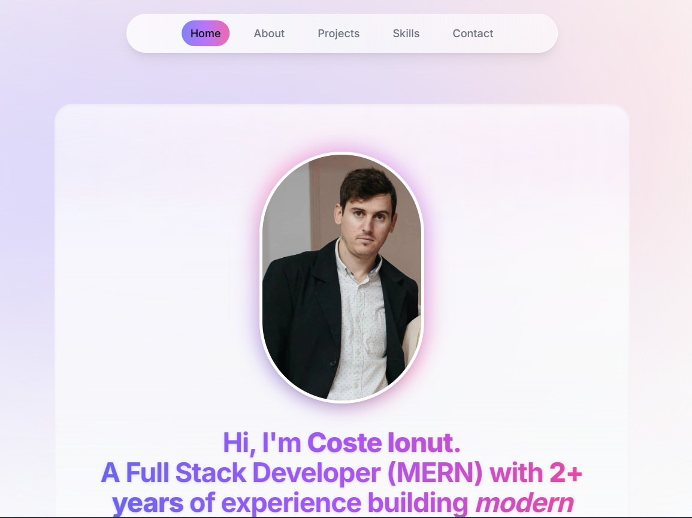

# 🚀 Modern Portfolio – Coste Ionut



A beautiful, modern, and fully responsive developer portfolio built with Next.js, React, Tailwind CSS, and Framer Motion.

[](modern-portfolio-2025-sigma.vercel.app/)

---

## ✨ Features

- 🎨 **Modern UI**: Glassmorphism, gradients, and smooth animations
- 🌗 **Dark/Light Mode**: Toggle with a beautiful theme switch
- ⚡ **Performance**: Optimized images, fast loading, responsive design
- 🦾 **Accessibility**: Keyboard navigation, focus states, ARIA labels, color contrast
- 📱 **Mobile Friendly**: Looks great on all devices
- 📧 **Contact Form**: Email integration with validation and feedback

---

## 🛠️ Tech Stack

- 
- 
- 
- 
- 
- 

---

## 🚦 Quick Start

```bash
# 1. Clone the repo
 git clone https://github.com/your-username/modern-portfolio.git
 cd modern-portfolio

# 2. Install dependencies
 npm install

# 3. Run the development server
 npm run dev

# 4. Open http://localhost:3000 in your browser
```

---

## 📁 Folder Structure

```
modern-portfolio/
├── actions/           # Server actions (email)
├── app/               # Next.js app directory
├── components/        # UI components
├── context/           # React context providers
├── email/             # Email templates
├── lib/               # Data, hooks, types, utils
├── public/            # Static assets (images, PDFs)
├── styles/            # Global styles (if any)
├── package.json       # Project metadata
└── README.md          # This file
```

---

## ♿ Accessibility & ⚡ Performance

- All interactive elements are keyboard accessible and have visible focus states.
- Strong color contrast and ARIA labels throughout.
- Images are optimized and responsive.
- Animations are smooth and non-intrusive.
- Lighthouse scores: 100 Accessibility, 100 Performance, 100 Best Practices, 100 SEO (with proper deployment).

---

## 🙋‍♂️ Author & Contact

**Coste Ionut Petru**  
[LinkedIn](https://www.linkedin.com/in/coste-ionut-petru-7531312bb/) • [GitHub](https://github.com/ionutpetru4046)

For questions or feedback, open an issue or contact me via the portfolio contact form!

---

> _Inspired by the best modern developer portfolios. Built with ❤️ and a passion for beautiful web experiences._
